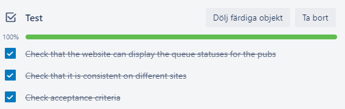
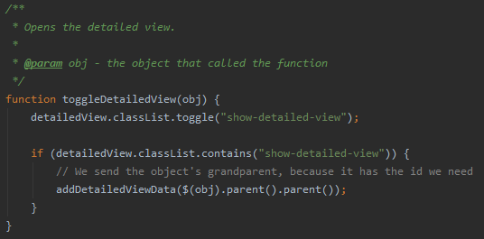

# Agile Software Project Management | DAT257
**Group 16 Members Githubs**

[Thomas Jinton   | cid: jintont  | github: ThomasT2](https://github.com/ThomasT2)

[Jennifer Krogh  | cid: kroghj   | github: jenniferkrogh](https://github.com/jenniferkrogh)

[Ludvig Lindell  | cid: ludlinde | github: Ludvig7](https://github.com/Ludvig7)

[Jesper Lundgren | cid: jeslundg | github: jeslundg](https://github.com/jeslundg)

[Johan Nilsson   | cid: nilssojo | github: lillejohn22](https://github.com/lillejohn22)

[Emma Pettersson | cid: emmp     | github: emmouto](https://github.com/emmouto)

[Antonia Welzel  | cid: welzel   | github: antoniiia](https://github.com/antoniiia)

## To pass the course
 - [x] [**Final Report**](https://github.com/lillejohn22/Team-16-Pubrundan-DAT257/blob/master/Deliverables/Final%20Team%20Reflection.pdf) \
Can be found in [*Deliverables*](https://github.com/lillejohn22/Team-16-Pubrundan-DAT257/tree/master/Deliverables)
      
 - [x] **Source Code** \
Can be found in this repo.
 
 - [x] **Tests** \
Can be found as a checklist on each User Story on the Scrum Board. 
 
 
 - [x] **Contribution Breakdown** \
We cannot get gitinspector to work. Use [**Contributors**](https://github.com/lillejohn22/Team-16-Pubrundan-DAT257/graphs/contributors) in the meantime. Emma has a lot of rows because she somehow got the credit for all the npm stuff. Ludvig has nothing because he worked together with Jesper and/or Johan all the time, so Jesper's commits are for both of them. We do not know why Antonia removed so many rows. 

#### Pair Programming
- Johan, Ludvid and Jesper worked together on the implementation of the server and the map features together.

- Johan and Antonia worked together on the design of the search and filtering features on the front-end of the website

 
 - [x] **Technical Documentation** \
  Can be found in all the .js-files, as both JavaDoc and normal comments. 
   
 
 - [x] **Instructions on how to install and use** \
 Can be found further down in this readme.
 
 - [x] **Weekly Reflections** \
Can be found in [*Deliverables/Team Reflections*](https://github.com/lillejohn22/Team-16-Pubrundan-DAT257/tree/master/Deliverables/Team%20Reflections) and [*Deliverables/Individual Reflections*](https://github.com/lillejohn22/Team-16-Pubrundan-DAT257/tree/master/Deliverables/Individual%20Reflections).
 
 - [x] [**Scrum Board**](https://trello.com/b/uNYqSmu7/agile)
   - [x] **User stories** \
   Each user story has the blue tag "User Story", and starts with a number, e.g. "1. As a user I want to see the pubs' queue length on the website, to avoid standing in long lines."
   - [x] **Effort estimation** \
   We call it "Points". One point = 1 hour.
   - [x] **Task Breakdown** \
   Each task starts with the number of the user story it belongs to, and then another number for the task, e.g. "1.1 Add queue indication to the box items."
   - [x] **Epics** \
   Our initiative was **"As a user, I want a web page for the pub rounds,"** and our epics *"I want information about the pubs"* and *"I want a map with the pubs."*


### Scrum Board

The Trello board is public and can be found [**here**](https://trello.com/b/uNYqSmu7/agile).

It contains:
 1. Scrum Board
    1. Product Backlog
    2. Tasks
    3. Sprint Backlog
    4. In Progress / To Check / Done
 
 2. Definition of Done
 
 3. List of Deliverables and their deadlines
 
 4. Meetings
    1. Planned meetings
    2. Finished Meetings
    
5. To Do-list

6. What was discussed in each Team Reflection


### Deliverables

All our deliverables ([*Social Contract*](https://github.com/lillejohn22/Team-16-Pubrundan-DAT257/blob/master/Deliverables/Social%20Contract.pdf), [*Project Scope*](https://github.com/lillejohn22/Team-16-Pubrundan-DAT257/blob/master/Deliverables/Project%20Scope.pdf), [*Team Reflections*](https://github.com/lillejohn22/Team-16-Pubrundan-DAT257/tree/master/Deliverables/Team%20Reflections), [*Sprint Retrospectives*](https://github.com/lillejohn22/Team-16-Pubrundan-DAT257/tree/master/Deliverables/Sprint%20Retrospectives) and [*Individual Reflections*](https://github.com/lillejohn22/Team-16-Pubrundan-DAT257/tree/master/Deliverables/Individual%20Reflections)) can be found here on GitHub, in the [*Deliverables*](https://github.com/lillejohn22/Team-16-Pubrundan-DAT257/tree/master/Deliverables) folder.


### Google Drive Folder

[Contains some meeting protocols, prototype sketches, and unfinished design document etc.](https://drive.google.com/drive/folders/1UJXMLQg57acr7RPwPpx-ZiAskqL6B5Q9?usp=sharing)
 Not neccessary reading.


- - - -

# Project setup
Instructions to install and run the project.   
It might run without installing NodeJS since NodeJS binaries are included in the repository.
 
## Installation
Download and Install NodeJS from [**NodeJS**](https://nodejs.org/en/).

## Run the project
1. To run the project open a command line.
2. Navigate to the project folder in your commandprompt.   
3. Run the following command: <br> 
   ```  npm run nodemon ``` 

# Development setup in IntelliJ
To run nodemon from IntelliJ go to:   
1. _Run_,  
2. _Edit Configurations..._,
3. Find and add a NodeJS configuration under templates.
4. In the lower box (before launch) add a NPM script.
5. Pick _nodemon_ as the script.   

 
